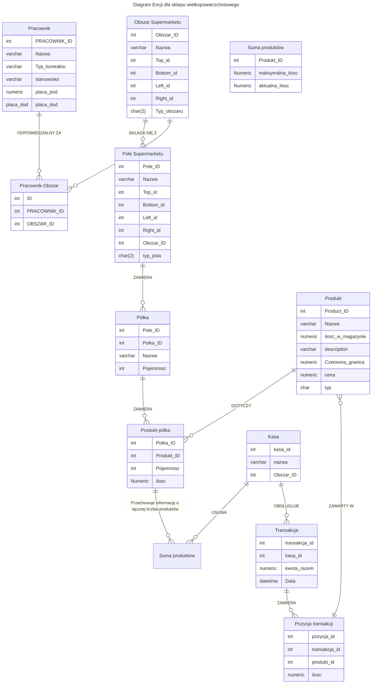

```mermaid
---
title: Diagram Encji dla sklepu wielkopowierzchniowego
---
erDiagram
	Pracownik{
		int PRACOWNIK_ID
		varchar Nazwa
		varchar Typ_kontraktu
		varchar stanowisko
		numeric placa_pod
		placa_dod placa_dod
	}
	"Pracownik-Obszar" {
        int ID
        int PRACOWNIK_ID
        int OBSZAR_ID
    }
	"Obszar Supermarketu"{
		Int Obszar_ID
		varchar Nazwa
		int Top_id
		int Bottom_id
		int Left_id
		int Right_id
		char(2) Typ_obszaru
		
	}
    "Pole Supermarketu" {
        int Pole_ID
        varchar Nazwa
		int Top_id
		int Bottom_id
		int Left_id
		int Right_id
		Int Obszar_ID
		char(2) typ_pola
    }
    "Półka"{
	    int Pole_ID
	    int Polka_ID
	    varchar Nazwa
	    int Pojemnosc
    }
    "Produkt-półka"{
	    int Polka_ID
	    int Produkt_ID
	    int Pojemnosc
	    Numeric ilosc
    }
    "Suma produktów"{
	int Produkt_ID
	Numeric maksymalna_ilosc
	Numeric aktualna_ilosc
	}
    "Produkt"{
	    int Product_ID
	    varchar Nazwa
	    numeric ilosc_w_magazynie
	    varchar description
	    numeric Czerwona_granica
	    numeric cena
	    char typ
    }
    "Pozycja transakcji"{
	    int pozycja_id
	    int transakcja_id
	    int produkt_id
	    numeric ilosc
    }
    Transakcja{
	    int transakcja_id
	    int kasa_id
	    numeric kwota_razem
	    datetime Data
    }
    Kasa{
	    int kasa_id
	    varchar nazwa
	    Int Obszar_ID
    }
    "Produkt-półka" ||--o{ "Suma produktow" : "Przechowuje informację o łącznej liczbie produktów"
    "Kasa" ||--o{ "Suma produktow" : USUWA
    Kasa ||--o{ Transakcja : "OBSŁUGUJE"
    Transakcja ||--o{ "Pozycja transakcji" : ZAWIERA
    "Produkt" ||--o{ "Produkt-półka" : "DOTYCZY"
    "Półka" ||--o{ "Produkt-półka" : "ZAWIERA"
    "Produkt" }o--|| "Pozycja transakcji" : "ZAWARTY W"
    "Pole Supermarketu" ||--o{ "Półka" : ZAWIERA
    "Obszar Supermarketu" ||--o{ "Pole Supermarketu" : "SKŁADA SIĘ Z"
	"Obszar Supermarketu" ||--o{ "Pracownik-Obszar" : DOTYCZY
	Pracownik ||--o{ "Pracownik-Obszar" : "ODPOWIEDZIALNY ZA"
	
```
